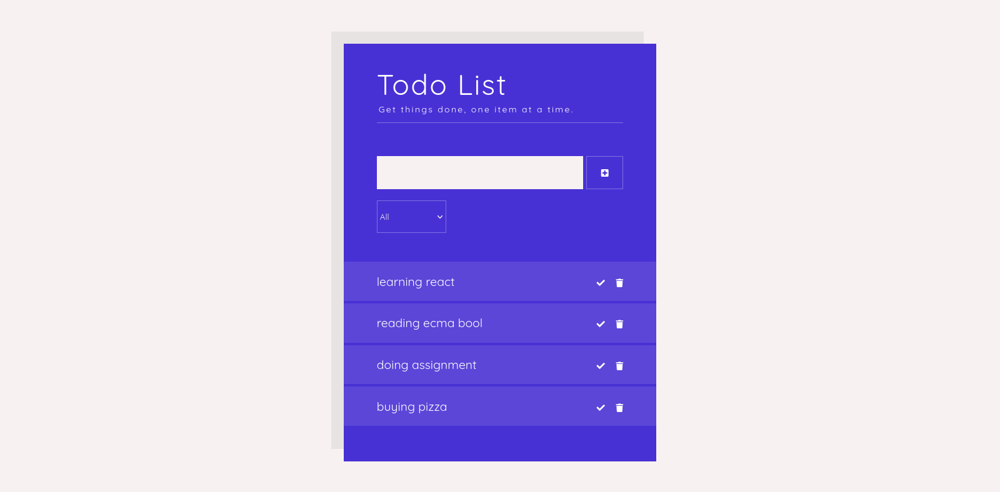

# Getting Started with Create React App
(https://github.com/SolomonSitotaw23/Todo-react.js/blob/master/public/preview.png)

## Available Scripts

In the project directory, you can run:
### 'npm install'
### `npm start`

Runs the app in the development mode.\
Open [http://localhost:3000](http://localhost:3000) to view it in your browser.

